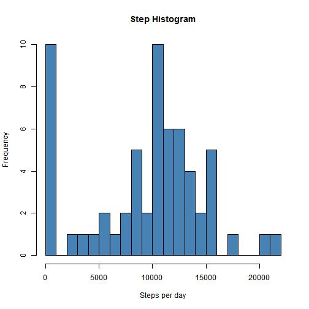
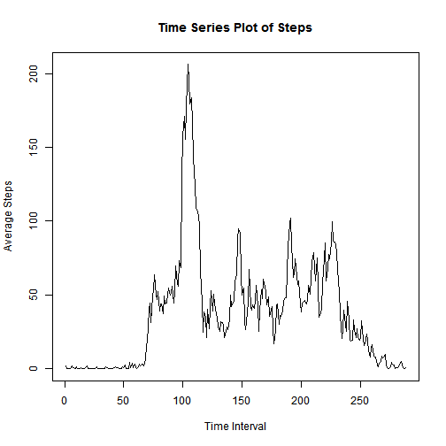
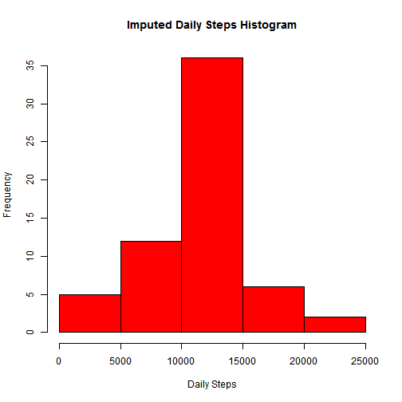

##Loading and preprocessing the data
```r
setwd("C:/Users/Luke/Desktop/Johns Hopkins Data Science/Reproducible Research/Week 1")
install.packages("knitr")

library(knitr)
#Read data
unzip("repdata-data-activity.zip")
raw <- read.csv("activity.csv", header = TRUE, sep = ",")
library(lubridate)
raw$date <-ymd(raw$date)
```
##What is the mean total number of steps taken per day?
```r
na <- raw[is.na(raw)]
dailysteps <- tapply(raw$steps, raw$date, sum, na.rm = TRUE)
dailysteps <- dailysteps[!is.na(dailysteps)]
hist(dailysteps, xlab= "Steps per day", main= "Step Histogram",
     breaks = 24, col= "steel blue")
```



```r
mean_steps <- mean(dailysteps)
median_steps <- median(dailysteps)
```

##What is the average daily activity pattern?
```r
mean_int <- tapply(raw$steps, raw$interval, mean, na.rm=TRUE)
plot(mean_int, type = "l", xlab= "Time Interval", 
     ylab= "Average Steps", main = "Time Series Plot of Steps")
```



```r
max <- max(mean_int)
match(max, mean_int)
```

```
## [1] 104
```

```r
mean_int[104] ##835 interval has max steps of 206.1698
```

```
##      835 
## 206.1698
```

##Impute Missing Values 
```r
sum(is.na(raw)) ##2304 number of NA
```

```
## [1] 2304
```

```r
raw_not_imputed <- raw
na <- is.na(raw$steps)
##replace NA with mean steps in that interval
mean_int <- tapply(raw$steps, raw$interval, mean, na.rm=TRUE) 
raw$steps[na]<- mean_int[as.character(raw$interval[na])]
sum(is.na(raw$steps)) ## 0 na cases
```

```
## [1] 0
```

```r
imputed_dailysteps<-tapply(raw$steps, raw$date, sum, na.rm = TRUE)
hist(imputed_dailysteps, col = "red", 
     xlab = "Daily Steps", main = "Imputed Daily Steps Histogram")
```



```r
mean_imputed_steps <- mean(imputed_dailysteps)
median_imputed_steps <- median(imputed_dailysteps)
```
##Differences in Weekday/Weekend
```r
  ##differentiate between weekday/weekend
raw$type <- ifelse(weekdays(raw$date)== "Saturday" 
            | weekdays(raw$date) == "Sunday", "weekend", "weekday")
head(raw)
```

```
##       steps       date interval    type
## 1 1.7169811 2012-10-01        0 weekday
## 2 0.3396226 2012-10-01        5 weekday
## 3 0.1320755 2012-10-01       10 weekday
## 4 0.1509434 2012-10-01       15 weekday
## 5 0.0754717 2012-10-01       20 weekday
## 6 2.0943396 2012-10-01       25 weekday
```

```r
library(lattice)
mean_by_int <- tapply(raw$steps, list(raw$interval, raw$type),mean)
library(reshape2)
mean_by_int <-melt(mean_by_int)
colnames(mean_by_int) <- c("interval", "type", "steps")
xyplot(steps ~ interval | type, data = mean_by_int, 
       layout = c(1,2), type = "l", main = "Average Steps", 
       xlab = "Interval", ylab = "Steps")
```


